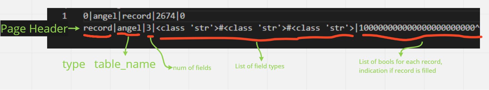
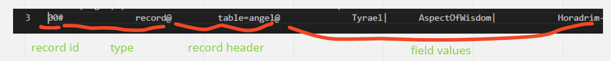
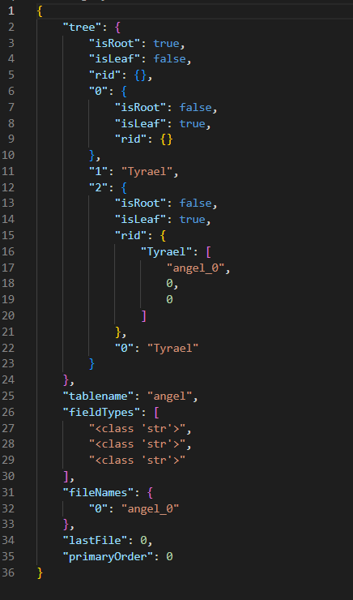
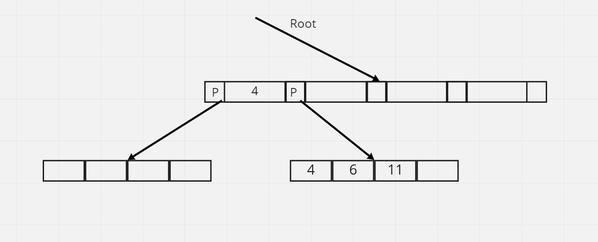
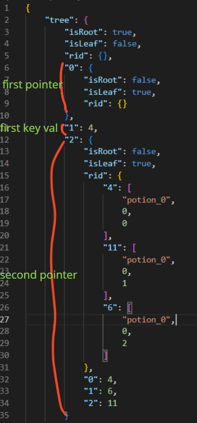

# Horadrim QL

Spring 2022 April 14, 2023

Batuhan Celik, Kadir Ersoy

- [Horadrim QL](#horadrim-ql)
  - [1 Introduction](#1-introduction)
  - [2 Assumptions \& Constraints](#2-assumptions--constraints)
    - [2.1 Assumptions](#21-assumptions)
    - [2.2 Constraints](#22-constraints)
  - [3 Storage Structures](#3-storage-structures)
    - [3.1 Pages](#31-pages)
    - [3.2 Records](#32-records)
    - [3.3 Files](#33-files)
    - [3.4 Relation Tables](#34-relation-tables)
    - [3.5 System Catalog](#35-system-catalog)
    - [3.6 Btree](#36-btree)
  - [4 Operations](#4-operations)
    - [4.1 HALO Definition Language Operations](#41-halo-definition-language-operations)
      - [4.1.1 Create](#411-create)
      - [4.1.2 Delete](#412-delete)
      - [4.1.3 List](#413-list)
    - [4.2 HALO Manipulation Language Operations](#42-halo-manipulation-language-operations)
      - [4.2.1 Create](#421-create)
      - [4.2.2 Delete](#422-delete)
      - [4.2.3 Update](#423-update)
      - [4.2.4 Search](#424-search)
      - [4.2.5 List](#425-list)
      - [4.2.6 Filter](#426-filter)
  - [5 Conclusion \& Assessment](#5-conclusion--assessment)

## 1 Introduction

We implemented a query language that supports;

- Creating relations with desired fields and field data types,
- Deleting the existing relations or listing them,
- Adding records to a relation,
- Updating and deleting the records,
- Efficiently searching for a record or filtering the records, via Btrees,
- Listing all records in the relation.

## 2 Assumptions & Constraints

Clearly specify your assumptions and constraints of the system in an itemized
or tabular format.

### 2.1 Assumptions

- The program expected to be executed in a Unix environment due to the
    new line character differences.
- The longest string stored in as a type name, a field name or data can be
    20 characters at maximum.
- The longest integer stored in a field can be at most 20 digits long.

### 2.2 Constraints

1. Maximum number of the fields in a table is 119. Number of fields is not
    limited, but our page size limit constraints it.
2. Each File stores up to 10 pages. Actually our files support infinite amount
    of pages but as they get larger, delete operation becomes more costly, thus,
    we had set this constraint.
3. File headers have maximum of 1000 byte length.

## 3 Storage Structures

### 3.1 Pages

Page size is 2.5 kilobytes. Pages have a header and list of records. Page header
includes;

- Page type, which provides what type of data this page will held (for now
    this feature is unused, we were expecting to store Btrees in pages and
    created page types for that, but we decided to use json later on),
- Table name, which table this page belongs to,
- Number of fields,
- List of field types(str, int)
- List of bools(0,1) indicating whether that slot of the page is filled or not.

Each page object has dictionary of records. We have stringify functions which
turns page data into a string to be stored in disk.
While writing pages to files, we write page header and records in order. Page
header items separated by ”|” char and ends with ’ˆ’ char.
Number of records stored depends on the number of fields the records have. We
limit the page size to 2.5 kb so that as number of fields a record has increased,
the space each record covers increases and number of records decreases.
Within pages, each record is given an ID and starts with it. Then comes the
record data each separated by ”-” chars.

<figure>

<figcaption align = "center"><b>Page = Page header + record id + record + ”-”</b></figcaption>
</figure>

### 3.2 Records

Record objects store header and data. Record data is list of field values. We
have stringify function for records as well. Records provide type, header and
list of field values;

- Record type (for now this feature only have type=record option and not
    used properly, we were expecting to store Btrees in pages and created
    record types for that, but we decided to use json later on),
- Record header, customizable, in our implementation it only stores which
    table the record belongs to.
- List of field values, separated by ”|”.

Record objects have the structure of : Records = type + record header + list
of field values.
Currently both types and headers are 20 characters long, this value can set
to any sufficiently large number.

<figure>

<figcaption align = "center"><b>Records = type + record header + list of field values.</b></figcaption>
</figure>

### 3.3 Files

Files have maximum of 10 pages. Each file has a header and list of pages. File
header is at max 1000 bytes. File header includes list of page metadatas. Page
metadata consists of;

- Page ID, given by file constructor,
- Table name, which table the page belongs to,
- Type of page, (we only have record pages type=record, stores table records)
- Bool(0,1), 1 if page is full.

### 3.4 Relation Tables

We have table objects for each relation created. Tables have files to store pages
and records and, a json file to store its Btree. At constructor, table reserves
itself files for record pages and Btree. To avoid creating already existing tables
from scratch, we save their data to a json before program end and reload from
json in a later execution.

<figure>

</figure>

### 3.5 System Catalog

We store system catalog as another table. It stores names of the existing tables.

### 3.6 Btree

Btrees are essentially linked Node objects. Each node stores;

- data: list of pointers and key values,
- isRoot: indicating whether node is root or not,
- isLeaf: indicating whether node is leaf or not,
- rids: dictionary of (data, recordID), only stored by leaf nodes.

While index nodes have 4 key values and corresponding 5 pointers in data, leaf
nodes have only 4 key values.

<figure>

</figure>

Each Btree stored in its own json file. Whenever a table object is created,
whether a new one or an existing one which is loaded from its file, a new tree
json will be created for the former option and the tree will be loaded to tree
object from the corresponding json for latter option. Creating tree object from
json handled by reading json and building the tree from root to leaves, connect-
ing pointers on fly. Essentially, in tree json, each node has a list of pointers and
key values. Since pointers are also pointing to nodes, we stored them as list of
pointers and key values as well.

<figure>

</figure>

## 4 Operations

### 4.1 HALO Definition Language Operations

#### 4.1.1 Create

To create a type, 2 operations are performed. Firstly a Table object is created,
then, a Btree object is created. This object stores and manages the files and
the B-Tree created for this type and manages their storage to the disk. If the
given type name already exists in the system catalog, then creation fails.

#### 4.1.2 Delete

When a relation is deleted,deleteTable()function is called from the specific
table instance. This instance firstly deletes files containing records, then the B
Tree. Finally, type name is removed from the system catalog. If the given type
name does not exist, the operation fails.

#### 4.1.3 List

To list all the types in the database, all type names stored in the system catalog
table is fetched using List DMLO.

### 4.2 HALO Manipulation Language Operations

#### 4.2.1 Create

To create a record, firstly, table instance checks for an available file. If there
is no available file, it creates one and sets a page within that file. After file
situation handled, It finds a page within file and inserts the record. Also inserts
given record to the related table tree.

#### 4.2.2 Delete

To delete a record, we search the record within the related tree. If record exists,
which is the expected case,search()function of tree returns recordId(filename,
pageID, slot). We get the file name and page ID that record belongs to from
recordID. Then delete the record from the page and the tree. Before finishing,
we update page header, to indicate the deleted record slot is now free.

#### 4.2.3 Update

To update the given record, we acquire its primary key and search with it within
table’s tree. Againsearch()function of tree returns us recordID. Using the
given file name, pageID and record slot within recordID, we update the related
page withupdate()function of page.update()basically checks if given field
values are valid, w.r.t type concerns, and updates the record.

#### 4.2.4 Search

To search the given primary key, we usesearch()function of tree again. As
function returns the recordID(filename, pageID, slot), we use it to find the record
within file and acquire all its fields.

#### 4.2.5 List

We have alist()function in Btree that finds min and max record and traverses
between, using the linked list of leafs. It returns list of recordIDs for all records.
Then similar to search, we use recordIDs to get all fields of records from files.

#### 4.2.6 Filter

Parsing the filter condition, we acquire a key value and a condition, greater
than, less than or equals to. For each case, we first search for given key in
the tree. After finding the record in the tree, we use the linked list of leafs to
acquire the rest. Then w.r.t to each case, for example for greater than, we get
the records with keys greater than the given condition key via traversing leaf
nodes using links between them. For less than, we traverse the record keys that
are less than the given condition key up until the minimum record stored in
tree. Equality case is nothing but a simple tree search.

## 5 Conclusion & Assessment

In overall, we were able to implement the structures we learned in the lecture.
We have quite the agile data storage but we have not used its properties. Our
files support multiple types of pages, our pages support multiple types of records,
with constant length, and these records must not be related! However, since
throwing everything in the same file or page would be too complicated to track,
we decided to match files and pages to tables for an easier implementation.
On the other hand, we implemented our B tree by ourselves and are quite
proud of it! We tested it extensively with hundreds of records and it performed
well in our last tests. One non DB related but valuable thing to learn was that
each acyclig graph’s being json serializable.
If we mention our shortcomings: Weak side of our implementation is buffer
management and deletion operation. Since buffer management was not included
in the scope of our project, we did not get involved with it. When a table is
required, it is loaded, then it loads a page. Upon completion of the operation,
table and page instances are deleted, then reloaded in the next operation if
requires. This results in a huge number of read operations. On the latter, we
used cursor and this constrained our ability to delete quite much. To delete a
page, we must load many others which is a slow operation and limits size of our
files quite much.

